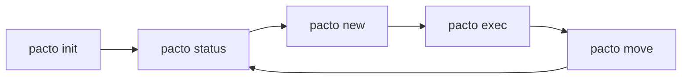

<div align="center">


<h1>Pacto</h1>

<p><strong>Spec-driven development (SDD) for teams that treat plans as executable contracts rather than stale documents.</strong></p>

<p align="center">
  <a href="https://github.com/triple0-labs/pacto-spec">Repository</a> ·
  <a href="https://github.com/triple0-labs/pacto-spec/issues">Issues</a>
</p>

<p align="center">
  <a href="https://github.com/triple0-labs/pacto-spec/actions/workflows/ci.yml"></a>
  <a href="https://github.com/triple0-labs/pacto-spec/releases"></a>
  <a href="./LICENSE"></a>
</p>

</div>

Pacto is a small, fast CLI that wires **markdown plan slices**, **explicit work states**, and **evidence-backed verification** into one loop. It is built for brownfield and greenfield repos where AI-assisted coding needs a durable source of truth: what the plan claims should match what the repository can prove.

## Philosophy

```text
-> specs before code
-> evidence over assumptions
-> lightweight over ceremony
-> practical for brownfield and greenfield
```

## How the loop works

Plans live under `.pacto/plans/`. The canonical contract file is `<plans-root>/PACTO.md`. `pacto status` reads plan claims (paths, symbols, endpoints, tests) and checks them against the tree — so “done” is grounded in the repo, not in prose alone.




For open-ended discovery before you cut a plan slice, use `pacto explore`.

Verification stays local: no network dependency for core `status` workflows.

## Why Pacto

- **Plan slices before implementation** — define work in `to-implement` / `current` / `done` (and `outdated` when superseded).
- **Progress you can trust** — `pacto status` reconciles plan claims with repository evidence.
- **Automation-friendly** — table or JSON output for terminals and CI.
- **Tooling without lock-in** — optional integrations (e.g. Codex, Cursor, Claude, OpenCode) via adapters; `AGENTS.md` is an optional hand-off layer when you generate it.

## Core commands


| Command        | Role                                                                    |
| -------------- | ----------------------------------------------------------------------- |
| `pacto init`   | Bootstrap `.pacto/plans` (and optional agent artifacts).                |
| `pacto status` | Inspect plan/evidence state; use `--format json` in scripts.            |
| `pacto new`    | Add a plan slice from the template and refresh the index.               |
| `pacto exec`   | Record execution progress and evidence in plan docs (no source edits).  |
| `pacto move`   | Drive explicit state transitions (`to-implement` → `current` → `done`). |


Typical sequence:

```text
pacto init  ->  pacto status  ->  pacto new  ->  pacto exec  ->  pacto move  ->  pacto status
```

Optional ideation: `pacto explore`.

## Install

### curl (recommended)

```bash
curl -fsSL https://raw.githubusercontent.com/triple0-labs/pacto-spec/main/install.sh | bash
```

### Go (from source)

```bash
go install ./cmd/pacto
```

## Quick start

```bash
pacto help
pacto version

pacto init
pacto init --no-interactive --tools codex,cursor --yes

pacto new to-implement improve-auth-flow
pacto status

pacto status --format json
pacto status --format json --verify --fail-on partial
pacto doctor --format json --fail-on any

pacto plugin list-available
pacto plugin install git-guardrails
pacto plugin list
pacto plugin validate
```

## Drift and hygiene

Catch stale generated artifacts or outdated integration patterns:

```bash
pacto doctor --format table
pacto doctor --format json --fail-on any
```

If drift is reported:

```bash
pacto update --artifacts
```

## CI example

```yaml
name: pacto-artifact-drift
on: [pull_request]
jobs:
  drift:
    runs-on: ubuntu-latest
    steps:
      - uses: actions/checkout@v4
      - uses: actions/setup-go@v5
        with:
          go-version: "1.24"
      - run: go build -o ./bin/pacto ./cmd/pacto
      - run: ./bin/pacto doctor --format json --fail-on any
```

## Documentation


| Doc                                          | Contents                                 |
| -------------------------------------------- | ---------------------------------------- |
| [Documentation index](./docs/README.md)      | Map of all guides and audits             |
| [Getting started](./docs/getting-started.md) | First-run setup and the default SDD loop |
| [Concepts](./docs/concepts.md)               | States, claims, verification             |
| [Commands](./docs/commands.md)               | CLI reference                            |
| [Integrations](./docs/integrations.md)       | Editors and agent adapters               |
| [Plugins](./docs/plugins.md)                 | Plugin model and guardrails              |
| [Architecture](./docs/architecture.md)       | Layers and extension points              |
| [Contributing](./docs/contributing.md)       | How to contribute                        |
| [Releasing](./RELEASING.md)                  | Maintainer release steps                 |


## Notes

- Use `--lang en|es`; `pacto init` persists workspace language in `.pacto/config.yaml`.
- `pacto exec` updates execution artifacts in plan docs only — it does not edit application source.
- Files under `.pacto/plans/` are workspace artifacts; product documentation lives under `docs/`.

## Logo

The mark is a **minimal raster** (no SVG in-repo): `assets/pacto-logo.png` (512×512, geometric pillars and bridge on white). Use that path in README previews, IDE, and docs. To change the artwork, replace the PNG under `assets/` (or regenerate via Cursor image generation and normalize to 512×512).