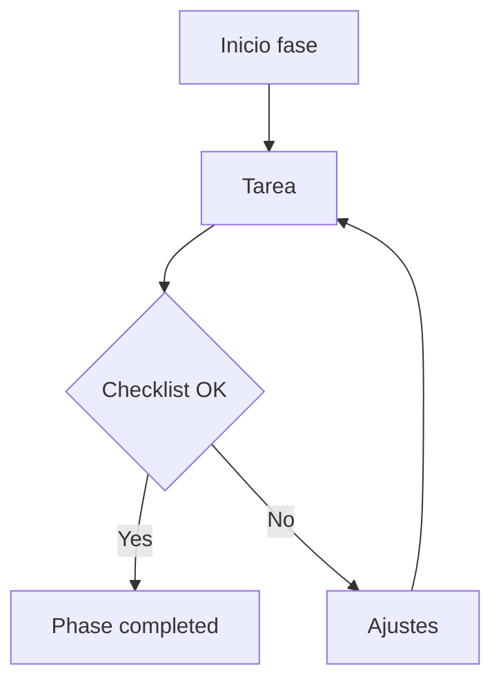

# Plan: <Título del plan>

**Versión:** 1.0  
**Fecha:** <YYYY-MM-DD>  
**Estado:** <Draft | En ejecución | Completado | Bloqueado>  
**Owner:** <nombre o equipo>

---

## Resumen

<Qué se quiere lograr en 3-6 líneas.>

## Contexto

<Contexto técnico/funcional y situación actual.>

## Objetivos

1. <Objetivo 1>
2. <Objetivo 2>
3. <Objetivo 3>

## No objetivos

1. <No objetivo 1>
2. <No objetivo 2>

## Progreso general

| Phase | Description | State | Progress | Est. duration | Actual duration |
|------|-------------|--------|----------|---------------|---------------|
| Phase 1 | <desc> | ⬜ Pending | 0% | <x> | — |
| Phase 2 | <desc> | ⬜ Pending | 0% | <x> | — |

**Progreso total:** <x>%  
**Tiempo restante estimado:** <x>

## Inventario de artefactos

| ID | Tipo | Estado | Ruta | Owner | Uso |
|----|------|--------|------|-------|-----|
| architecture-flow-v1 | diagrama | draft | ./README.md#diagrama-de-flujo | <owner> | explicar arquitectura/flujo |
| smoke-mvp-v1 | checklist | active | ./README.md#checklist-de-smoke | <owner> | validar salida funcional |

## Decisiones (ADR breve)

1. **Decisión:** <texto>  
   **Rationale:** <texto>  
   **Fecha:** <YYYY-MM-DD>

2. **Decisión:** <texto>  
   **Rationale:** <texto>  
   **Fecha:** <YYYY-MM-DD>

## Implementation Plan by Phases

## Phase 1: <optional title>

**Objetivo:** <texto>  
**Estado actual:** <texto>

**Tasks**

- [ ] 1.1 <task>
- [ ] 1.2 <task>

**Entregables**

1. <entregable>
2. <entregable>

**Criterio de salida**

1. <criterio>
2. <criterio>

## Phase 2: <optional title>

**Objetivo:** <texto>  
**Estado actual:** <texto>

**Tasks**

- [ ] 2.1 <task>
- [ ] 2.2 <task>

**Entregables**

1. <entregable>
2. <entregable>

**Criterio de salida**

1. <criterio>
2. <criterio>

## Plan de pruebas

1. <test técnico 1>
2. <test técnico 2>
3. <test integración>

## Smoke checklist

1. <paso smoke 1>
2. <paso smoke 2>
3. <paso smoke 3>

## Diagrama de flujo

## Historial de deltas

### Delta D-<YYYY-MM-DD>-01

- **Fecha:** <YYYY-MM-DD HH:MM>
- **Autor:** <owner>
- **Scope:** <Phase/area>
- **Tipo:** <feat|fix|refactor|docs|test>
- **Estado:** <applied|partial|reverted>
- **Cambios:**
  - `+ <archivo/ruta>`
  - `~ <archivo/ruta>`
  - `- <archivo/ruta>`
- **Validación:**
  - `<comando>` -> `<resultado>`
- **Riesgo:** <bajo|medio|alto> - <nota>
- **Rollback:** <cómo revertir>
- **Siguiente delta:** <acción concreta>

## Checkpoint (opcional)

**Checkpoint (<YYYY-MM-DD HH:MM>):**

1. <resumen de deltas incluidos>
2. <estado/progreso consolidado>

## Matriz de verificación (plan vs código)

| Claim | Tipo | Evidencia esperada | Ruta/Comando | Estado |
|-------|------|--------------------|--------------|--------|
| <ej: Endpoint X implementado> | endpoint | símbolo/ruta presente | <ruta o comando de búsqueda> | <verified/partial/unverified> |
| <ej: Test Y en verde> | test | resultado reproducible | <comando test> | <verified/partial/unverified> |

## Dependencias

1. <dependencia 1>
2. <dependencia 2>

## Riesgos y mitigaciones

1. **Riesgo:** <texto>  
   **Mitigación:** <texto>

2. **Riesgo:** <texto>  
   **Mitigación:** <texto>

## Criterios de éxito

1. <criterio 1>
2. <criterio 2>
3. <criterio 3>

## Siguientes pasos

1. <paso 1>
2. <paso 2>
